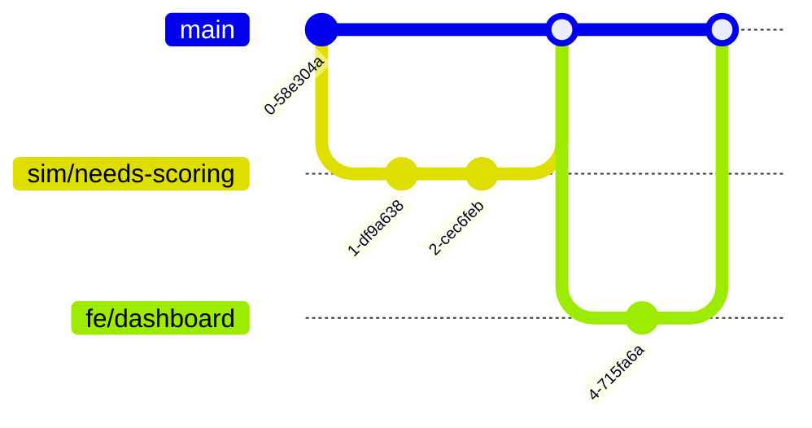

# Branching Strategy

SOCIETAS uses a **subsystem-prefixed branching model** on top of GitHub Flow. This ensures six developers can work in parallel with minimal merge conflicts.

---

## Branch Naming

```
<prefix>/<description>
```

### Prefixes

| Prefix  | Subsystem       | Owner               |
|---------|-----------------|---------------------|
| `sim/`  | Simulation      | Simulation Engineer |
| `ai/`   | AI / Gemma      | AI Systems Engineer |
| `be/`   | Backend API     | Backend Engineer    |
| `fe/`   | Frontend        | Frontend Engineer   |
| `infra/`| Infrastructure  | DevOps Engineer     |
| `docs/` | Documentation   | Technical Lead      |
| `fix/`  | Cross-cutting   | Any                 |

### Examples

```
sim/needs-based-scoring
ai/persona-generation-pipeline
be/simulation-control-api
fe/real-time-dashboard
infra/ci-workflow-optimization
docs/adr-escalation-threshold
fix/simulation-seed-non-determinism
```

---

## Main Branch

- `main` is always deployable
- All changes merge into `main` via squash-merge PRs
- `main` history is linear after squash-merges

---

## Workflow



1. Create a feature branch from `main`
2. Work on your branch with regular commits
3. Open a PR against `main`
4. Pass CI checks and code review
5. Squash-merge into `main`
6. Delete the feature branch

---

## Avoiding Conflicts

1. **Own your directory** — CODEOWNERS maps each top-level directory to one owner
2. **No cross-subsystem commits** — Don't modify files outside your ownership in a single branch
3. **Interface contracts** — Agree on API boundaries before implementation; document in ADRs
4. **Rebase before PR** — `git rebase main` before opening a PR to resolve conflicts locally
5. **Small, focused PRs** — One logical change per PR, reviewed within 24 hours

If you must modify shared files (e.g., `docker-compose.yml`, root `pyproject.toml`), coordinate with the owning team member.

---

## CI Protection

All branches pushed to GitHub trigger CI checks. PRs cannot merge unless:

- All CI checks pass
- At least one CODEOWNER approves
- No merge conflicts exist
- Conventional commit title is valid

---

## Related

- [Development Workflow](development-workflow.md)
- [CODEOWNERS](../../.github/CODEOWNERS)
- [CONTRIBUTING](../../CONTRIBUTING.md)
- [CI Workflows](../../.github/workflows/)
